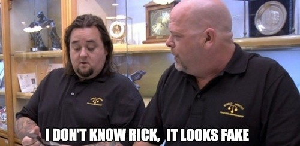

People ask me how to learn stuff and is an interesting topic as the human mind is different and there
is a lot of learning models out there to achieve it. Recently I discovered the **Dreyfus model** of
skill acquisition and I was astonished by how this model explains this with really basic concepts on
how we can progress and improve ourselves to achieve our goals.

I've started to do different things in my daily life, like trying to get adequate sleep and having a
compelling reason to wake up so each day, before sleeping, I ask myself what I've learned and how I
can apply that to the next days. If you have long-term goals, then you will have a challenge that
will make you keep doing stuff to grow. Another thing I made years ago was beating procrastination
and sure it was a hard one. For me was very easy to spend a lot of time on Facebook or Twitter just
scrolling for updates and interacting with people as fast as I could or watching funny videos on
Youtube. Nothing of that is bad, the bad part of it is _spending a lot of time_ doing it.

One of the most powerful forms of self-improvement is learning new skills but the process of
acquiring them isn't clear. Yes, we can read a book or be in a workshop for that, but is a hard task
that will require a lot of effort. There are different stages of learning, and most of the people
aren't excited to be in the early process.

The _[Dreyfus model](http://www.dtic.mil/cgi-bin/GetTRDoc?AD=ADA084551&Location=U2&doc=GetTRDoc.pdf)_
is a framework to measure your progress in any skill. Whether you want to learn a new programming
language, become a dancer or learn how to write, this model will help you to get a perspective on
where are you and how to improve to go for the next level with it.

Invented by **Stuart** and **Hubert Dreyfus** at **UC Berkeley** in 1980, stablish that acquiring
a skill employing instruction and experience, the student normally passes trough five developmental
stages. It argues that based on the analysis of careful descriptions of skill acquisition, the student
depends less on abstract principles and more on concrete experience.

It defines five developmental stages:

- Novice
- Advanced Beginner
- Competent
- Proficient
- Expert

I believe that some people would find it hard to know in which stage they are as the person needs a
good level of awareness and recognition, also everyone wants to be at the expert level but don't want
to be in the novice stage.

Nothing is easy, everything is hard and takes time to acquire a new skill. If you had no impediments
that restrained you from learning how to walk, maybe you already forgot that you learned by
imitation and trial-and-error, probably you had an instructor to aid you and encourage you to
keep trying while giving useful tips. But, are you an _expert_ on walking? Maybe not. And that's
fine as maybe your goal isn't to participate professionally in walking marathons. But, if that's
your goal, then you should keep looking forward to improving that skill.

Let's get a better description of each stage:

## Novice

The novice stage is the first level of skill acquisition, where you are just getting started in
the skill and have little familiarity with it. Because you don't have any idea of what you're doing
or how to keep advancing, the best way of acquiring knowledge is by following a set of rules to
complete the task within the skill.

Something interesting about the description of this stage is that a student graduating from college
who only focused on his grades might be a novice or possibly isn't at this level. Some colleges
are focused on other teaching models and some students are focused more on their grades than really
learning and doing something with that knowledge. That's why you always need to learn how to learn.
**A Teacher probably isn't an expert**, and being an expert doesn't give you automatically an expert
stage on teaching skill. I believe this knowledge is something amazing as the teacher doesn't know the
answers of everything, but he may have an idea of where you can acquire the answers.

One example of a novice student is the one who is learning how to drive and is given rules such as
the need to shift to the next gear after the speedometer points to a certain number. I remember
very well that my father told me that once that you gain certain expertise, you will hear and feel
when a shift is necessary. So, a novice has no context of why some stuff needs to be done.
As a novice, the subject can easily get overwhelmed by all the things that he needs to learn and will
wonder how a person can do all these things as getting to that level seems impossible at that moment.

## The Advanced Beginner

Once we learned the basic rules, we will probably reach this stage. After coping from real examples,
we will start understanding the context and noting the variables that matter in the recipe. For
example, as an advanced beginner programmer, you will try to add more functionality to your first
program, maybe you will change some variables and see if it still works. You have the experience of
how to initiate a project with a new programming language and learned the basics so you can start
to develop the idea in your mind. **You will find a lot of errors and will fail a lot**. But what is
the amazing of that? well, that you can make mistakes and start reasoning about them and experiment
beyond the examples you were given in the previous stage. You have a safe environment for trying new
things.

Although we've reached this stage, we haven't fully understood the whole context and still need
some guidance about why or how things should go. Eventually, with more exposure to the skill and
more practice, we will start to understand the importance of each part of the information and be
able to walk to the next stage.

## Competent

At this phase, we will be able to recognize patterns and the things are going to start to get
interesting (_finally_) and frustrating (_oh no!_). Here we stopped to follow a set of rules, and
we discover how to apply them in our tasks. Maybe we don't need all the rules for our current
task and thanks to the previous stage experimentation, we will be able to have a better perception
of what does each of one. In algebra, I started to skip to write some steps as I found it easy to
follow them in my head, and if you like it, you probably did the same. We start to learn how to
ignore some of the rules as they were so many and now it seems so natural to omit them as maybe
you already merge them or make them without thinking.

If you're a competent web developer, you've worked a lot with JavaScript. You know a variety of
methods that are provided by the language and some techniques on how to use them for several
examples. But even knowing all these things, you will fail in some cases and success in others,
making this a trial-error. Something interesting is that you become emotionally involved in the
outcome since now the set of rules are made by you. This is why when you succeed, you will
experience a big joy for the right choice of steps.

This is a hard stage as now the subject is attached to the outcome and can be emotively overwhelming
if there is a lot of fails. **The key to success is learning by failing**. If you can overcome this and
have a perspective on why things went wrong, then you can start changing the recipe for making less
prone to errors the set of rules you're managing.

## Proficient

At this stage, the involved, experienced performer sees goals and salient aspects but not what to
do to achieve these goals. This means that **you're pretty good at what you do**. The proficient
performer simply has not yet had enough experience with the outcomes of the wide variety of possible
responses to each of the situations he or she can now discriminate among to react automatically.

For example, if you are a programmer, you will see a code and feel that something isn't good,
maybe the way the variables are named or could be possible that there are too many things happening
in one block and is hard to read or reason about. You know that it doesn't sound right. That
code smells bad. Although you already identify the smell, you still need to make a conscious
selection among the options on how to fix it and probably you will try different paths to see
which one is the best option.

## Expert

Normally an expert does not calculate. He or she does not solve problems. He or she does not
even think. He or she just does what normally works and, of course, it normally works. At this
point, the expert sees immediately how to achieve the task with his or her vast repertoire of
tools. The ability to make more subtle and refined discriminations is what distinguishes the expert
from the proficient performer.

As you can notice, **the expert operates entirely by intuition** and, to the outside spectators,
this could seem like magic. For example, there are a lot of famous people in different areas
and, if you see them live or in the video, you will look at how they can perform their skill
as if it were breathing.

## Wrap up

This is very interesting, and after I discover it, I've been trying to train some of my weak
points on the skills that I want to grow. I believe that this is really helpful to understand
that we always are a novice and how can we reach the next stage. So, always start by following
a recipe and the experiment by adding more things or changing the variables to discover what you
can or can't change in that set of rules.

According to the Dreyfus brothers, **most of the people are in the advanced beginner stage**. That's
something really hard to process at first, and I believe that a good method is to believe that we
are on that stage, even if we are experts in one skill. I like what Socrates said: "_The only true
wisdom is in knowing you know nothing_" and push a little every day so I can learn and grow with
the pass of time.

The amount of words that I spent in each stage has a meaning. It takes time to jump from one stage to
another, and some needs several things to make it while others look very similar stage but once that
you spot the difference, you will be able to know what it takes to be there.

I hope that you've learned something new today.

And remember, enjoy the ride when learning.
